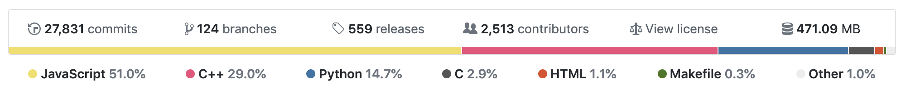
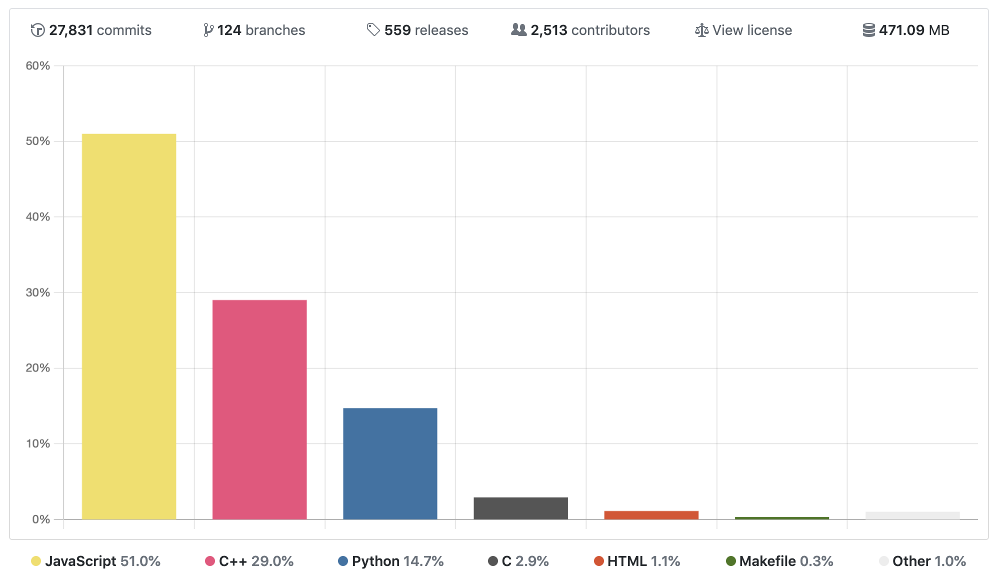
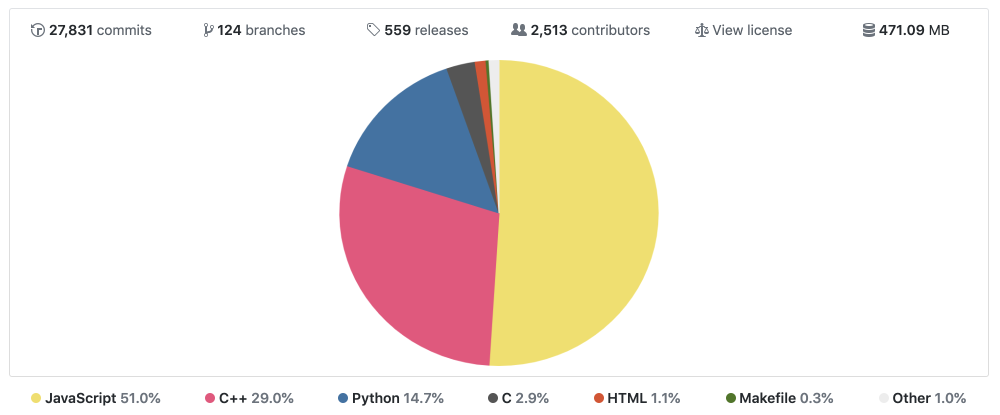
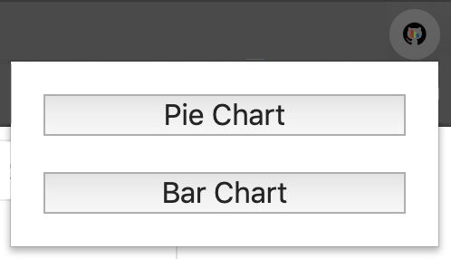
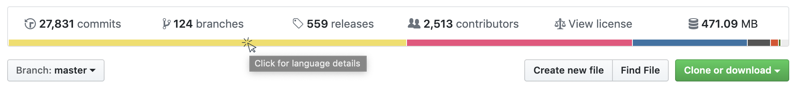

 
# GitHub Language Visualization

### Google Chrome extension for different visualization options for the languages used in your GitHub repository.

Traditionally, GitHub uses a thin percentage bar to show the proportion of each language used in the repository:

  

Using [Chart.js](https://www.chartjs.org/), this extension provides you with a variety of visualization options to display the different languages, yet still maintain a clean look and feel.

 

# Install

Download from the Chrome Web Store: [GitHub Language Visualization](https://chrome.google.com/webstore/detail/github-language-visualiza/bddlfanigdohhdpgkiajgdpopnigkkno)

# How to use

**Use the toolbar icon to select your preferred display option.**:

 

**Click on the GitHub percentage bar to display the chart and language details.**:

 

**Click on the chart to hide it again.**

# License

MIT
